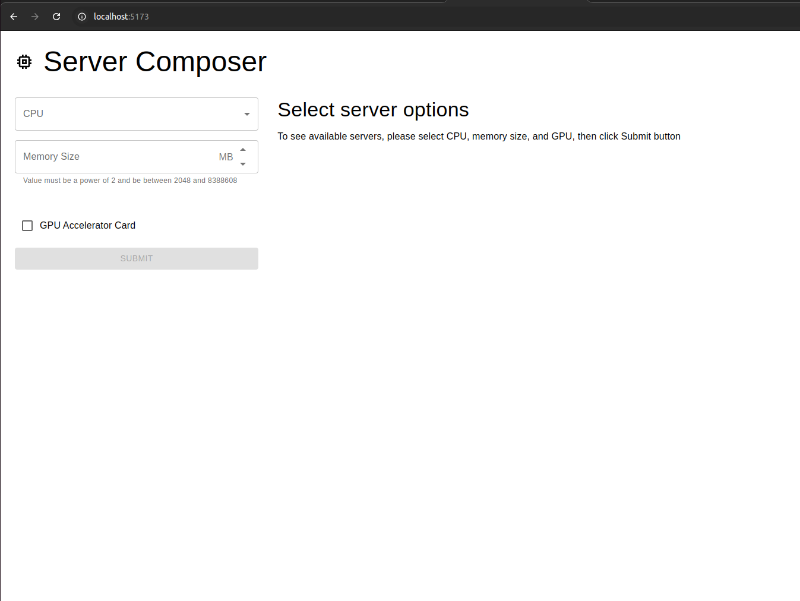
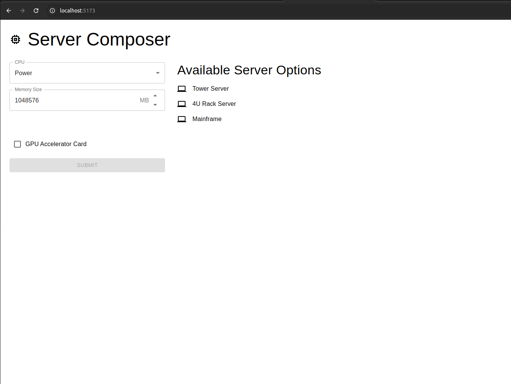
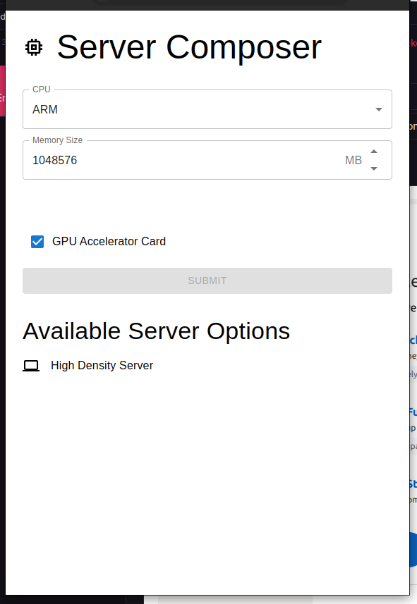

# Server Composer

## Installation

```
git clone https://github.com/vkolesn/sag-task
cd sag-task
npm install
```

## Starting a dev server

```
npm run dev
```

The server should be accessible at http://localhost:5173/

## Linting

```
npm run lint
```

## Testing

PlayWright tests use .env for base URL. Update it if your server's URL
is different from http://localhost:5173/

```
npm run test
```

## Operation demo

Initial state



Example selection





A demo video

https://github.com/user-attachments/assets/0080f7f4-75c9-4900-8cf8-60c6931050ad

